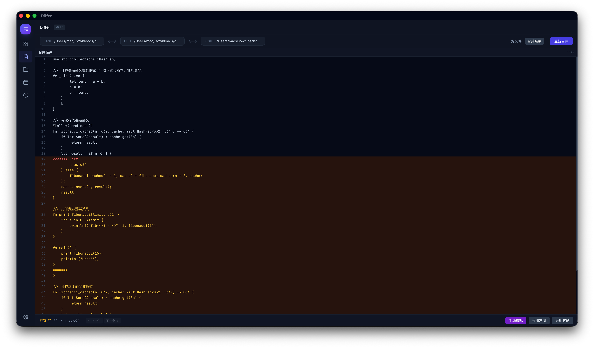

# Differ

A modern desktop application for file comparison and merging, built with Tauri v2 and SolidJS.



## Features

- **Side-by-Side Diff** — Line-by-line comparison of two files with syntax highlighting, scroll sync, and inline change details.
- **3-Way Merge** — Merge two file versions against a common base with conflict detection and resolution.
- **Directory Comparison** — Recursively compare two directories, showing added, removed, and modified files in a tree view.
- **Syntax-Aware Diff** — Powered by tree-sitter AST analysis, hunks are intelligently regrouped by function/class boundaries with context headers.
- **Live File Watching** — Monitor files for changes and automatically re-run diff on save.
- **History Tracking** — All diff and merge operations are persisted locally for quick access.
- **Keyboard Navigation** — Full keyboard shortcuts for efficient workflow.
- **Dark Theme** — Carefully crafted dark UI for reduced eye strain.

### Supported Languages for Syntax-Aware Diff

- Rust
- JavaScript / JSX
- TypeScript / TSX
- Python

## Installation

### macOS

Download the latest `.dmg` from the [Releases](https://github.com/your-org/differ/releases) page.

```bash
# Or build from source (see below)
```

### Build from Source

**Prerequisites:**

- [Rust](https://rustup.rs/) (1.80+)
- [Node.js](https://nodejs.org/) (20+)
- [Tauri CLI System Dependencies](https://v2.tauri.app/start/prerequisites/)

```bash
# Clone the repository
git clone https://github.com/your-org/differ.git
cd differ

# Install frontend dependencies
npm install

# Run in development mode
npm run tauri dev

# Build for production
npm run tauri build
```

## Usage

1. **File Diff** — Open two files from the Dashboard or drag them in, view side-by-side changes.
2. **Directory Diff** — Select two directories to see a recursive comparison tree.
3. **3-Way Merge** — Provide a base file and two modified versions to merge with conflict resolution.
4. **Syntax Mode** — Toggle between line-level and syntax-aware diff grouping for supported languages.

### Keyboard Shortcuts

| Shortcut | Action |
|----------|--------|
| `Ctrl+N` | New diff |
| `Ctrl+S` | Toggle syntax mode |
| `Ctrl+W` | Close tab |
| `Ctrl+Tab` | Next tab |
| `Escape` | Close dialogs |

## Tech Stack

- **Frontend**: SolidJS, TypeScript, Tailwind CSS, Vite
- **Backend**: Rust, Tauri v2
- **Diff Engine**: `similar` crate (line-level diff)
- **Syntax Analysis**: tree-sitter (Rust, JavaScript, TypeScript, Python)
- **Storage**: Tauri Plugin Store (history persistence)

## Project Structure

```
src/
├── components/       # UI components (DiffView, MergeView, Dashboard, etc.)
├── dsl/              # Design system component library
├── lib/              # Utilities and stores (historyStore, navStore, etc.)
├── types/            # TypeScript type definitions
└── App.tsx           # Root application component

src-tauri/
├── src/
│   ├── commands/     # Tauri commands (diff, merge, etc.)
│   ├── diff/         # Diff engine (text_diff, syntax_diff, merge, etc.)
│   └── lib.rs        # Tauri application entry point
└── Cargo.toml
```

## Development

```bash
# Run tests
npm test                # Frontend tests (Vitest)
cd src-tauri && cargo test  # Backend tests (Rust)

# Run with hot-reload
npm run tauri dev
```

## License

MIT
